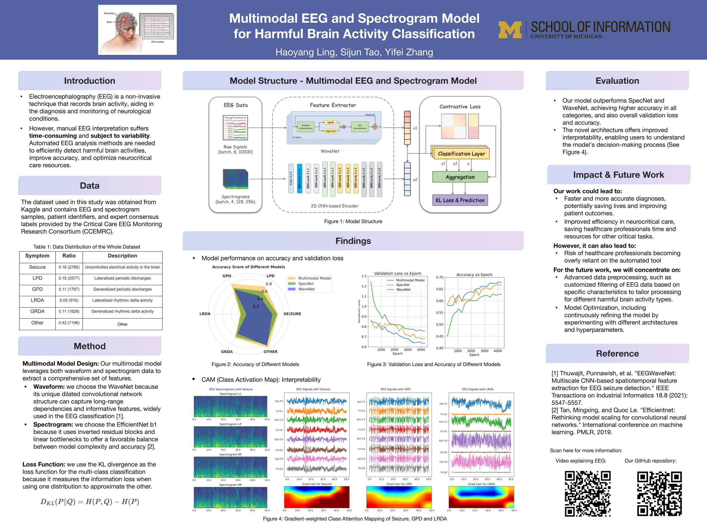

# SI699-HMS

  

## Introduction

Electroencephalography (EEG) is a non-invasive method of monitoring and recording electrical activity in the brain, which plays a crucial role in diagnosing and treating various brain-related disorders, particularly in critically ill patients. However, the manual interpretation of EEG data remains a major bottleneck in neurocritical care, as it is time-consuming, expensive, and prone to fatigue-related errors and inter-rater reliability issues. To address these challenges, there is a pressing need to develop automated methods for EEG analysis. The objective of this research is to develop a robust model trained on EEG signals to automatically detect and classify seizures and other types of harmful brain activity, aiming to assist doctors and brain researchers in providing faster and more accurate diagnoses and treatments. This work has significant implications for improving patient care in neurocritical settings, advancing epilepsy research, and supporting the development of new therapeutic interventions.

## Data
The dataset consists of electroencephalography (EEG) recordings labeled with different types of harmful brain activity patterns, including seizures, periodic discharges (generalized and lateralized), and rhythmic delta activity (generalized and lateralized). Even expert annotators often disagree on the correct classifications, highlighting the complexity of this task.

  

The dataset comprises the following files:
- train.csv and test.csv: Metadata files containing information about the EEG and spectrogram samples, patient identifiers, and for the training set, the expert consensus labels and vote counts from annotators.
- sample_submission.csv: A file showing the required format for submissions, which should contain the predicted probabilities for each brain activity class.
- train_eegs/ and test_eegs/: Folders containing the raw EEG data recordings, sampled at a frequency of 200 Hz.
- train_spectrograms/ and test_spectrograms/: Folders containing spectrogram image representations of the EEG data.
- example_figures/: A folder with larger versions of the example images used in the overview section.

For train.csv, the detailed information is given:
| **Column Name**                 | **Description**                                                                    |
|---------------------------------|------------------------------------------------------------------------------------|
| eeg_id                          | A unique identifier for the entire EEG recording.                                  |
| eeg_sub_id                      | An ID for the specific 50-second long subsample this row's labels apply to.        |
| eeg_label_offset_seconds        | The time between the beginning of the consolidated EEG and this subsample.         |
| spectrogram_id                  | A unique identifier for the entire EEG recording.                                  |
| spectrogram_sub_id              | An ID for the specific 10-minute subsample this row's labels apply to.             |
| spectogram_label_offset_seconds | The time between the beginning of the consolidated spectrogram and this subsample. |
| label_id                        | An ID for this set of labels.                                                      |
| patient_id                      | An ID for the patient who donated the data.                                        |
| expert_consensus                | The consensus annotator label. Provided for convenience only.                      |

### Data Distribution
| **Symptom**                 | **Ratio**     | **Description**|
|-----------------------------|---------------|-----------------|
| Seizure                     | 0.16 (2785)   | Uncontrolled electrical activity in the brain |
| LPD                         | 0.15 (2577)   | Lateralized periodic discharges|
| GPD                         | 0.11 (1787)   | Generalized periodic discharges|
| LRDA                        | 0.05 (916)    | Lateralized rhythmic delta activity (slow-wave activity in one hemisphere of the brain)|
| GRDA                        | 0.11 (1828)   | Generalized rhythmic delta activity (slow-wave activity in both hemispheres of the brain)|
| Other                       | 0.42 (7196)   | |

## Model Prototype

  

## Grad-CAM

  
  

## How to compile
The data size is quite large (26.4GB) and also accelerator is required to run this project, so we highly recommend you to run the code in Kaggle, and you can directly load data inside from [the hms page](https://www.kaggle.com/competitions/hms-harmful-brain-activity-classification/overview). For convenience, we provide the sample data on the [Kaggle platform](https://www.kaggle.com/datasets/yifeizhhh/hba-sampled-data/data) to play with. Do please follow the competition rules and guidelines to use the data.

You can find the all codes in the `code` directory. You can use the jupyter notebook to run the code. The code is divided into the following parts:

- `contrastive-experiment`: training and evaluation code. The provided notebook runs with the sample data.
- `contrastive-visualization`: part of visualization code
- `contrastive-cam`: grad-cam visualization
- `eeg_dataset`: dataloader for EEG data
- `exp`: experiment class for training and evaluation
- `model`: model architecture
- `tests`: test code for the model
- `utils`: utility functions for the project

We have examined the code format for the python file with pylint (9.12/10) and black.

## Acknowledgments

Special thanks to the following website for the valuable resources and inspiration:

- [EfficientNetB2 Starter]([https://www.website-a.com](https://www.kaggle.com/code/cdeotte/efficientnetb0-starter-lb-0-43)): EfficientNetB2 Starter.
- [EfficientNetB0 PyTorch]([https://www.kaggle.com/code/alejopaullier/hms-efficientnetb0-pytorch-inference])): EfficientNetB0 PyTorch.
